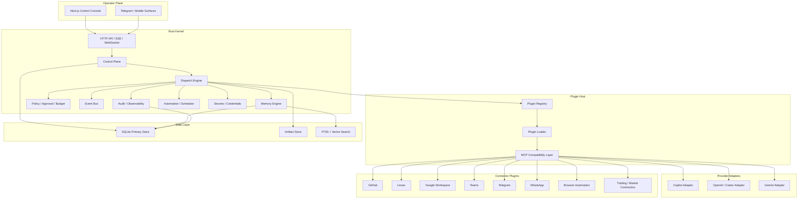
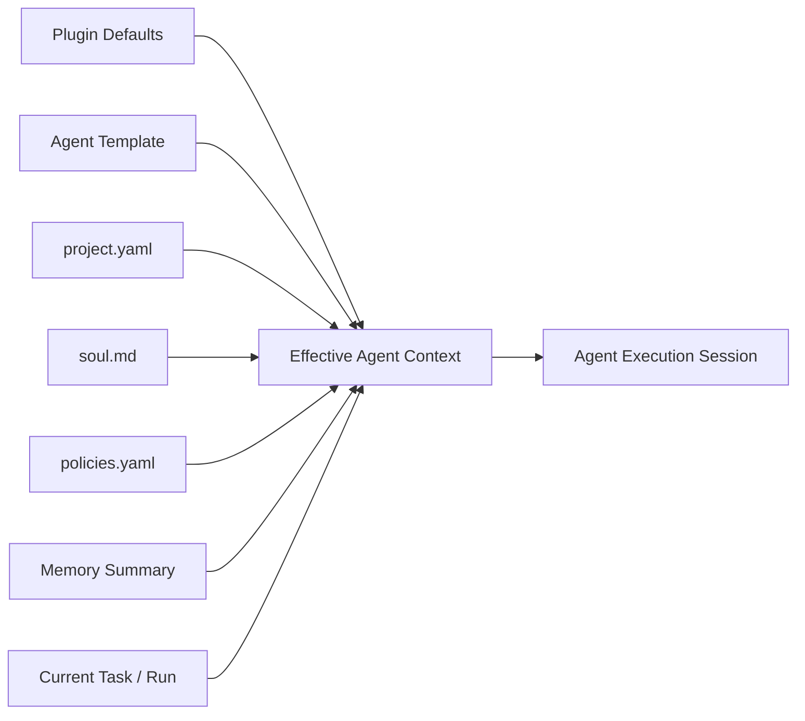
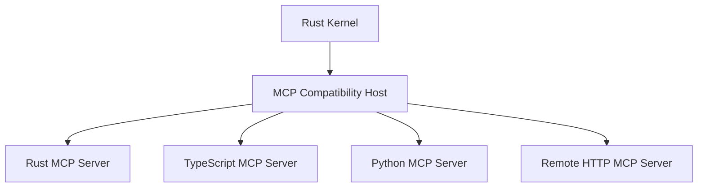
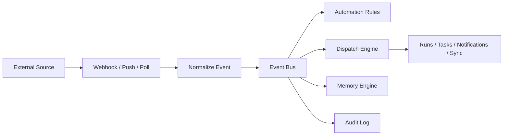

# Consulting Automation OS

Version: v1  
Date: 2026-03-29

## 1. Purpose

This document consolidates the target architecture for the platform that will replace the current Max backend and become the operating system for a high-throughput consulting business.

The objective is not to build a chatbot with integrations.

The objective is to build a `consulting automation platform` that lets one human operator coordinate many client engagements in parallel through:

- agent dispatch
- project control
- connector sync
- event-driven automation
- reusable workflows
- memory and context continuity
- strong auditability
- strict performance and long-running stability

## 2. Core Intent

The system must allow a single operator to supervise multiple client engagements at the same time while the platform handles:

- triage
- synchronization across tools
- task progression
- follow-ups
- artifact generation
- coding execution
- reporting
- contextual recovery

This means the platform must be:

- local-first where useful
- server-capable where necessary
- provider-agnostic
- plugin-extensible
- event-driven
- long-running
- highly observable

## 3. Non-Negotiable Decisions

These decisions are locked unless there is a very strong reason to change them:

1. The backend kernel is Rust.
2. The frontend remains Next.js + TypeScript.
3. The architecture is hexagonal.
4. Plugins are first-class.
5. MCP is a primary interoperability layer.
6. The business core is not implemented inside plugins.
7. Push and webhook eventing are preferred over cron and heartbeat whenever officially supported.
8. TypeScript and Python MCP servers must remain usable through a compatibility layer.
9. Agent behavior is composed from reusable templates plus project-specific context.
10. The system must be able to run continuously for very long periods without manual babysitting.

## 4. Architectural Principles

### 4.1 Kernel First

The platform is centered around a fixed kernel responsible for:

- state
- policy
- orchestration
- event routing
- memory
- approvals
- audit
- budgets
- observability

Plugins add capabilities. Plugins do not own the business runtime.

### 4.2 Plugin Bundles

A plugin is a bundle of capabilities and reusable assets. A plugin can contain:

- one or more MCP servers
- skills
- agent templates
- workflow templates
- policies
- schemas
- connector metadata
- UI metadata

### 4.3 Project Context Outside The Plugin

Plugins are reusable and versioned. Project-specific context must live outside the plugin.

This is required for:

- reuse
- versioning
- reproducibility
- client isolation

### 4.4 Event-Driven By Default

When a service supports official watch, webhook, subscription, or push semantics, the platform should use that first.

Fallback order:

1. push or webhook
2. renewable subscription
3. cursor-based polling
4. heartbeat or synthetic scheduler

### 4.5 Multi-Language Compatibility

The backend kernel is Rust. That does not mean every integration must be rewritten in Rust on day one.

The platform must be able to consume:

- Rust MCP servers
- TypeScript MCP servers
- Python MCP servers
- remote HTTP MCP servers

through one unified compatibility layer.

## 5. System Overview



## 6. The Fixed Kernel

The kernel is the durable part of the platform. It should be implemented in Rust and split into bounded contexts.

### 6.1 Kernel Responsibilities

- workspaces, clients, projects, milestones, tasks
- agent templates, agent instances, run execution
- normalized event ingestion and routing
- budgets, guardrails, approvals
- memory and retrieval
- scheduling and automation
- audit trails and metrics
- secrets and provider credentials
- artifact references and lifecycle

### 6.2 Kernel Bounded Contexts

Recommended contexts:

1. `identity`
2. `workspaces`
3. `projects`
4. `agents`
5. `runs`
6. `memory`
7. `connectors`
8. `automation`
9. `policy`
10. `audit`
11. `artifacts`

### 6.3 Kernel Technologies

Recommended:

- Rust stable
- `tokio`
- `axum`
- `tower`
- `serde`
- `sqlx`
- `tracing`
- `uuid`
- `time`

## 7. Plugin Model

## 7.1 Definition

A plugin is a versioned bundle that extends the kernel without changing the kernel.

It can provide:

- MCP servers
- skill packs
- agent templates
- workflow templates
- connector declarations
- policy defaults
- optional UI metadata

## 7.1.1 Codex-Inspired Packaging Model

The packaging model should intentionally follow the useful parts of the Codex plugin shape:

- `plugin.json` for the manifest
- `.mcp.json` for MCP server declarations
- `.app.json` for connector or app bindings
- `skills/` for workflow guidance
- `agents/` for reusable agent templates
- `workflows/` for reusable orchestration logic

This is a good foundation because it keeps discovery, interoperability, and reusable behavior in one distributable bundle.

The important adaptation is this:

- Codex-style packaging is adopted
- business state is not

So the packaging idea is copied, but mutable project state stays outside the plugin.

## 7.2 Plugin Bundle Structure

Recommended shape:

```text
plugins/<plugin-id>/
├─ plugin.json
├─ .mcp.json
├─ .app.json
├─ skills/
├─ agents/
├─ workflows/
├─ policies/
├─ schemas/
└─ assets/
```

### 7.3 What Lives In The Plugin

- reusable integration logic
- reusable templates
- reusable workflows
- reusable policy defaults
- package metadata

### 7.4 What Does Not Live In The Plugin

- client-specific strategy
- project-specific identity
- project memory
- mutable project state
- run-local state

## 8. Project Context Model

The system needs a clear distinction between reusable capability and project identity.

Recommended project instance shape:

```text
projects/<project-id>/
├─ project.yaml
├─ soul.md
├─ policies.yaml
├─ context/
├─ memory/
├─ artifacts/
└─ runs/
```

## 8.1 `project.yaml`

Structured stable context:

- client
- project type
- roadmap
- milestones
- stack
- repositories
- kanban bindings
- connector bindings
- SLA
- risk class
- budget rules

## 8.2 `soul.md`

Human-readable strategic identity for the project.

This file defines:

- mission
- tone
- operating style
- priorities
- non-goals
- definition of done
- client-specific communication posture

This is the right place for what you called `soul.md`.

It should be project-specific and editable.

## 8.3 `policies.yaml`

Per-project rules for:

- approvals
- allowed actions
- budget ceilings
- time windows
- escalation paths

## 8.4 Memory

Memory is separate from the declarative project profile.

This is critical.

- `project.yaml` tells the system what the project is.
- `soul.md` tells the system how the project should be approached.
- `memory` tells the system what it has learned over time.

## 9. Agent Model

## 9.1 Agent Templates

Agent templates are reusable archetypes stored in plugins.

Examples:

- `pm-agent.md`
- `delivery-agent.md`
- `coder-agent.md`
- `research-agent.md`
- `client-comms-agent.md`

These are not project-specific.

## 9.2 Agent Instances

An agent instance is a project-bound instantiation of a template.

An instance is formed by combining:

- plugin defaults
- agent template
- project profile
- `soul.md`
- policy overlay
- memory summary
- current task/run context

## 9.3 Context Composition



This composition rule is one of the most important design constraints in the entire platform.

## 10. MCP And Multi-Language Compatibility

## 10.1 The Decision

MCP should be treated as a primary compatibility protocol.

This gives the platform:

- access to existing ecosystems
- immediate reuse of TypeScript and Python servers
- a path to wrap external systems without rewriting everything in Rust

## 10.2 Compatibility Layer

The Rust kernel should not care whether a capability provider is:

- Rust local process
- TypeScript local process
- Python local process
- remote HTTP MCP server

The compatibility layer should normalize all of them.

## 10.3 Capability Layer Diagram



## 10.4 What The Compatibility Layer Must Provide

- process lifecycle
- startup handshake
- capability discovery
- timeout handling
- retries
- health checks
- circuit breaking
- logging and tracing
- schema caching
- secret injection
- rate limiting

## 10.5 Practical Implication

This means existing TypeScript or Python MCP servers can be adopted immediately and optimized later.

This is the right tradeoff.

Do not block the architecture on rewriting every integration in Rust.

## 11. Eventing Model

## 11.1 Preferred Modes

Each connector plugin must declare its supported ingestion modes:

- `webhook`
- `push_subscription`
- `poll`
- `manual`

## 11.2 Normalized Connector Interface

Every connector should expose operations like:

- `subscribe`
- `renew`
- `verify`
- `normalize_event`
- `ack`
- `recover_cursor`
- `list_capabilities`

## 11.3 Event Flow



## 11.4 Priority Order

When supported officially:

1. push
2. webhook
3. renewable watch channel
4. polling
5. heartbeat fallback

## 11.5 Why This Matters

This is what frees the platform from artificial scheduler load and useless wake-ups.

The more connectors are event-native, the less the system behaves like a polling robot and the more it behaves like a live operational platform.

## 12. Memory Architecture

Memory is strategic and must be layered.

## 12.1 Memory Types

### Operational Memory

Append-only run history:

- prompts
- tool calls
- external events
- approvals
- outputs
- failures

### Episodic Memory

Compressed summaries of meaningful work and decisions.

### Semantic Memory

Embeddings-backed retrieval over:

- docs
- transcripts
- ticket history
- decisions
- artifacts

### Working Memory

Short-lived state bound to the active run.

## 12.2 Storage Strategy

Phase 1:

- SQLite
- FTS5
- vector search through SQLite `vec1`

Future:

- possible Postgres upgrade
- possible ParadeDB if full Postgres migration becomes justified

## 13. Data Layer

## 13.1 Primary Storage

Use SQLite first, but design storage ports from day one.

Why:

- low operational cost
- good local-first ergonomics
- good fit for single-node kernel
- excellent starting point for speed of execution

## 13.2 Artifacts

Artifacts should not be shoved blindly into the main DB.

Use:

- SQLite for metadata and indexing
- file store or object-like store for large artifacts

Artifacts include:

- docs
- generated reports
- transcripts
- screenshots
- exports
- patches
- analysis outputs

## 14. Execution Plane

The current single orchestrator queue is not sufficient.

The target system needs:

- multi-run dispatch
- bounded concurrency
- run priorities
- backpressure
- retry policies
- escalation policies
- explicit approvals
- idempotent re-entry

## 14.1 Execution Model

Recommended:

- one dispatcher
- many run workers
- project-aware queues
- capability-aware routing
- provider-aware routing

## 14.2 Run States

At minimum:

- `queued`
- `preparing`
- `running`
- `awaiting_approval`
- `blocked`
- `retrying`
- `completed`
- `failed`
- `cancelled`

## 15. Provider Model

The platform should support different reasoning and execution backends behind a common interface.

Recommended provider classes:

- `ReasoningProvider`
- `InteractiveSessionProvider`
- `EmbeddingProvider`
- `ToolAwareExecutionProvider`
- `ComputerUseProvider`

Initial adapters:

- Copilot
- OpenAI / Codex
- Gemini

## 16. Capability Model

Plugins should expose capabilities, not random one-off procedures.

Examples:

- `message.read`
- `message.send`
- `calendar.watch`
- `calendar.create`
- `issue.create`
- `issue.update`
- `repo.read`
- `repo.write`
- `browser.navigate`
- `browser.extract`
- `market.read`
- `market.order.place`

This is how workflows remain portable.

## 17. Workflow Model

A workflow is a reusable orchestration pattern that composes capabilities and policies.

Examples:

- consulting inbox triage
- daily client brief
- roadmap sync
- task promotion
- meeting prep and follow-up
- coding dispatch
- trading strategy analysis

Workflows can live in plugins, but their execution and state are owned by the kernel.

## 18. Frontend Architecture

The frontend is not just an admin panel. It is the operator console.

Recommended surfaces:

1. inbox
2. projects
3. roadmap and kanban
4. runs
5. agents
6. connectors
7. memory
8. approvals
9. automations
10. observability

## 18.1 Frontend Rules

- Next.js App Router
- server components by default
- client components only for interaction islands
- typed contracts generated from backend APIs
- streaming for run status and live updates
- premium design system

## 19. Performance Strategy

Performance is not a polishing concern. It is architectural.

## 19.1 Backend

- Rust kernel for long-running stability
- bounded queues
- backpressure everywhere
- append-only event log
- hot path separation from cold path indexing
- async I/O
- process isolation for non-Rust plugin runners
- capability result caching where safe
- structured tracing for bottleneck analysis

## 19.2 MCP Compatibility

To keep non-Rust MCP servers practical:

- keep them out-of-process
- pool long-lived plugin processes where useful
- restart unhealthy processes automatically
- cache discovered schemas and tool metadata
- avoid repeated cold start cost on every invocation

## 19.3 Memory And Search

- FTS for exact and lexical retrieval
- vector retrieval only where semantically useful
- summary compression for long-lived contexts
- no uncontrolled context growth

## 20. Proposed Repository Shape

```text
/
├─ apps/
│  └─ web/
├─ crates/
│  ├─ domain/
│  ├─ application/
│  ├─ ports/
│  ├─ infra-http/
│  ├─ infra-sqlite/
│  ├─ kernel-dispatch/
│  ├─ kernel-memory/
│  ├─ kernel-policy/
│  ├─ kernel-events/
│  ├─ plugin-host/
│  ├─ provider-copilot/
│  ├─ provider-openai/
│  ├─ provider-gemini/
│  └─ connector-runtime/
├─ plugins/
│  ├─ github/
│  ├─ linear/
│  ├─ google/
│  ├─ telegram/
│  ├─ browser/
│  └─ polymarket/
├─ projects/
│  └─ <project-id>/
├─ packages/
│  ├─ ui/
│  ├─ contracts/
│  └─ sdk/
└─ docs/
```

## 21. Recommended First Plugin Waves

First wave:

- GitHub
- Linear
- Google Workspace
- Telegram
- Browser automation

Second wave:

- WhatsApp
- Teams
- market and trading connectors
- CRM and finance plugins

Reason:

The first wave is what most directly supports consulting throughput and operator leverage.

## 22. Recommended First Workflow Waves

First wave:

- inbox triage
- task and issue synchronization
- daily client/project brief
- meeting prep and follow-up
- coding dispatch

Second wave:

- outbound client communications
- promotion rules between roadmap states
- growth and commercial workflows
- market/trading automation

## 23. Plugin Manifest Draft

Recommended plugin manifest fields:

- `id`
- `name`
- `version`
- `kind`
- `description`
- `capabilities`
- `mcp_servers`
- `skills`
- `agent_templates`
- `workflow_templates`
- `default_policies`
- `required_secrets`
- `supported_events`
- `ingress_modes`
- `ui`
- `healthcheck`
- `compatibility`

## 24. Immediate Next Design Artifacts

The next documents that should exist after this one are:

1. `plugin-manifest-schema-v1.md`
2. `event-envelope-schema-v1.md`
3. `project-context-schema-v1.md`
4. `agent-context-composition-v1.md`
5. `run-lifecycle-v1.md`
6. `connector-ingestion-model-v1.md`
7. `policy-and-approval-model-v1.md`
8. `frontend-information-architecture-v1.md`

## 25. Final Bottom Line

The correct architecture is:

- a Rust kernel
- a plugin-first extension model
- MCP as a compatibility protocol
- strict separation between reusable plugin logic and mutable project context
- event-native connector ingestion
- agent context built by composition

This gives you:

- immediate reuse of existing TypeScript and Python MCP servers
- a serious long-running backend
- a path to internalize more and more of the intelligence over time
- a platform that can grow gradually without collapsing under its own integrations
